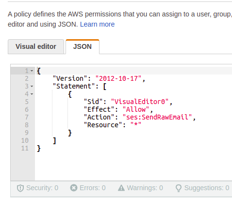

# Purpose
By default, WordPress uses the server to send mail. That requires technical knowledge of how to configure a server. WordPress and a lot of third party plugins use a function called wp_mail() to send mail. 

This plugin allows you to continue to use wp_mail but will then take the values sent to it and instead of using the local server to send email, it will use AWS SES SDK. 

There is a [small cost](https://aws.amazon.com/ses/pricing/) to send emails with AWS SES. It is pay as you go.

# Setup

### AWS IAM Permissions
You will need to create an IAM user (or if you are running this on AWS infrastructure, have your instance role), with the permissions of SendRawEmail on the SES v2 service.




### Set environment variables
```
REWAS_FROM_ADDRESS=foobar@example.com
REWAS_FROM_NAME="Foo Bar"
REWAS_REGION=us-east-1

AWS_ACCESS_KEY_ID=XXX
AWS_SECRET_ACCESS_KEY=XXX
# AWS_PROFILE=foobar
```

`REWAS_FROM_ADDRESS` - The address SES will use to send your emails. This address will need to be [configured](https://docs.aws.amazon.com/ses/latest/dg/creating-identities.html#verify-email-addresses-procedure) in AWS SES to be allowed to send emails. 

`REWAS_FROM_NAME` - The name you want in the From. This is usually prefixed before the email address in the headers of an email.

`REWAS_REGION` - Set which region you want to send the mail from. If this is not set, it uses `us-east-1`. Note: you must setup AWS SES in this region, that includes requesting being moved out of sandbox mode, prior to expecting this to work.

If you are using this to send to [unverified people](https://docs.aws.amazon.com/ses/latest/dg/verify-addresses-and-domains.html), then you will need to request to take your AWS SES account out of [Sandbox mode](https://docs.aws.amazon.com/ses/latest/dg/request-production-access.html).

You will want to use either `AWS_ACCESS_KEY_ID` and `AWS_SECRET_ACCESS_KEY` or `AWS_PROFILE`. `AWS_PROFILE` is the profile found in ~/.aws/credentials. If you want to use an `AWS_PROFILE`, then comment out `AWS_ACCESS_KEY_ID` and `AWS_SECRET_ACCESS_KEY` and uncomment `AWS_PROFILE`. Note, if you are running this on an AWS instance, just grant the role, SendRawEmail and you shouldn't have to mess with setting any AWS_ variables because they should be set automatically.


# Modify this project
If you just want to use this plugin, all the above should get you going. However, if you want to fork this project and easily get up and running to modify it and make your own version, the documentation for that can be found in [BUILD.md](BUILD.md)

